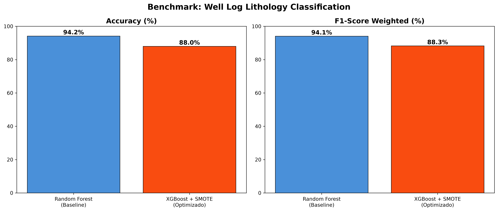
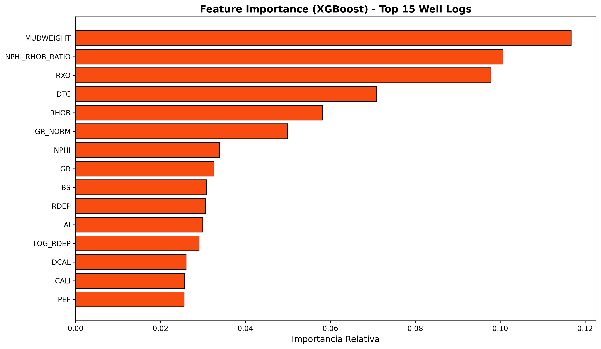

# Well Log Lithology Prediction (FORCE 2020)

[](https://www.python.org/)
[](https://xgboost.readthedocs.io/)
[](https://scikit-learn.org/)

English Description Below | Descricao em Portugues Abaixo

---

## Descricao (Portugues)

Pipeline completa de Machine Learning para classificacao automatica de litologias a partir de dados de perfis de poco (Well Logs) do Mar da Noruega. O modelo recebe curvas geofisicas (Gamma Ray, Resistividade, Densidade, Neutrao, Sonico, etc.) e classifica automaticamente o tipo de rocha em 12 categorias litologicas.

### Principais Tecnologias
- **Python:** Linguagem principal da pipeline.
- **XGBoost:** Modelo de Gradient Boosting optimizado para classificacao multi-classe.
- **Scikit-Learn:** Baseline (Random Forest) e metricas de avaliacao.
- **SMOTE (Imbalanced-Learn):** Balanceamento sintetico para litologias raras (Dolomite, Coal, Basement).
- **Plotly / Matplotlib:** Visualizacao de Well Logs e resultados.
- **Streamlit:** Interface Web interactiva com dois modos de visualizacao.

### Dataset
- **FORCE 2020 Machine Learning Lithology Prediction Competition** (Noruega)
- 1.17 milhoes de amostras de 98 pocos no Mar da Noruega
- 12 classes litologicas (Sandstone, Shale, Limestone, Chalk, Marl, Halite, Anhydrite, Tuff, Coal, Dolomite, Basement, Sandstone/Shale)
- Licenca: NOLD 2.0

### Resultados do Benchmark

| Modelo | Accuracy | F1-Score (Weighted) |
|--------|----------|---------------------|
| Random Forest (Baseline) | 94.19% | 94.08% |
| XGBoost + SMOTE | 88.02% | 88.27% |

O SMOTE sacrifica deliberadamente accuracy global para melhorar o Recall nas litologias raras (ex: Tuff subiu de 87% para 91%, Coal de 70% para 76%).


*Comparacao de Performance entre Random Forest e XGBoost + SMOTE.*


*Importancia relativa dos Well Logs na classificacao litologica.*

### Feature Engineering
O script de preprocessamento cria 7 features petrofisicas derivadas:
- **GR Normalizado:** Indice de argilosidade.
- **Impedancia Acustica (AI):** RHOB * DTC.
- **Ratio Neutrao-Densidade:** Separacao de litologias.
- **Diferenca de Resistividades:** Indicador de hidrocarbonetos.
- **Log Resistividade:** Melhoria da distribuicao.
- **Ratio DTS/DTC:** Indicador de tipo de fluido.
- **Delta Caliper:** Estabilidade do poco.

### Como Executar

```bash
# 1. Clonar o repositorio
git clone https://github.com/heltrakinho07/well-log-analysis.git
cd well-log-analysis

# 2. Criar ambiente virtual e instalar dependencias
python3 -m venv .venv
source .venv/bin/activate
pip install -r requirements.txt

# 3. Pre-processar os dados
python src/preprocess.py

# 4. Treinar os modelos
python src/train.py

# 5. Lancar a interface web
streamlit run app/streamlit_app.py
```

### Estrutura do Projeto
```
well-log-analysis/
  data/raw/           # Dados brutos FORCE 2020
  data/processed/     # Dados limpos
  src/preprocess.py   # Limpeza e feature engineering
  src/train.py        # Treino e benchmark
  src/predict.py      # Funcao de previsao
  app/streamlit_app.py # Interface Web
  models/             # Modelos treinados (.joblib)
  reports/            # Graficos de resultados
```

---

## Description (English)

End-to-end Machine Learning pipeline for automatic lithology classification from well log data in the Norwegian Sea. The model takes geophysical logging curves (Gamma Ray, Resistivity, Density, Neutron, Sonic, etc.) and automatically classifies the rock type across 12 lithological categories.

### Core Technologies
- **Python:** Main pipeline language.
- **XGBoost:** High-performance Gradient Boosting for multi-class classification.
- **Scikit-Learn:** Baseline model (Random Forest) and evaluation metrics.
- **SMOTE (Imbalanced-Learn):** Synthetic balancing for rare lithologies (Dolomite, Coal, Basement).
- **Plotly / Matplotlib:** Well Log visualization and results plotting.
- **Streamlit:** Interactive Web interface with two viewing modes.

### Benchmark Results

| Model | Accuracy | F1-Score (Weighted) |
|-------|----------|---------------------|
| Random Forest (Baseline) | 94.19% | 94.08% |
| XGBoost + SMOTE | 88.02% | 88.27% |

SMOTE deliberately trades overall accuracy for improved Recall on rare lithologies (e.g., Tuff recall rose from 87% to 91%, Coal from 70% to 76%).
